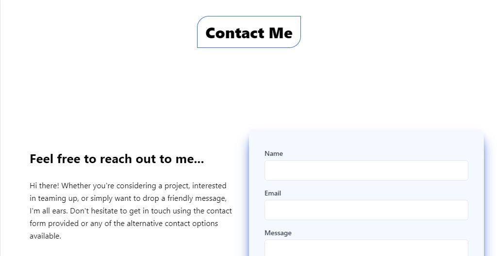

Welcome to my portfolio! This project serves as a showcase of my skills, projects, and experiences. Built using the React.js , this portfolio is designed to provide an interactive and engaging experience for visitors.

## Key Features
**Responsive Design:** The portfolio is meticulously designed to work seamlessly on various devices and screen sizes, ensuring an optimal viewing experience for everyone.

**Project Showcase:** Explore a collection of my recent projects links to repositories.

**About Me:** Learn more about my background, skills, and passions. Get to know the person behind the code.

**Contact Information:** Easily get in touch with me through the provided contact information and social media links.

## Installation 
- Clone the repository: git clone https://github.com/AbuzarYaseen/Portfolio.git
- Navigate to the project directory: cd my_portfolio
- Install dependencies: npm install
- Start the development server:
```bash
npm run dev
# or
yarn dev
# or
pnpm dev
```

Open [http://localhost:3000](http://localhost:3000) with your browser to see the result.

## Technologies 
**React.js:**  A robust JavaScript library that facilitates efficient front-end development, offering a wide range of features for building dynamic user interfaces and interactive web applications. While React doesn't inherently provide server-side rendering or optimized routing like Next.js, it empowers developers with flexible tools and a vibrant ecosystem for crafting high-performance and engaging digital experiences.

**JavaScript:**  The primary programming language used to create interactive and dynamic elements within the portfolio, enhancing user engagement and interactivity.

**Tailwind CSS:**  A utility-first CSS framework that streamlines the styling process, resulting in a visually appealing and consistent design across the entire portfolio.

**Git and GitHub:**  Version control and collaborative development were facilitated through Git, with the project's codebase hosted and publicly accessible on GitHub.

**npm:** The Node Package Manager (npm) was used to manage project dependencies, making it easy to integrate external libraries and tools.

Key Features
Responsive Design: The portfolio is meticulously designed to work seamlessly on various devices and screen sizes, ensuring an optimal viewing experience for everyone.

Project Showcase: Explore a collection of my recent projects links .

About Me: Learn more about my background, skills, and passions. Get to know the person behind the code.

Contact Information: Easily get in touch with me through the provided contact information and social media links.

Installation

Install dependencies: npm install
Start the development server:
npm run dev
# or
yarn dev
# or
pnpm dev
Open http://localhost:3000 with your browser to see the result.

Technologies
React.js: A robust JavaScript library that facilitates efficient front-end development, offering a wide range of features for building dynamic user interfaces and interactive web applications. While React doesn't inherently provide server-side rendering or optimized routing like Next.js, it empowers developers with flexible tools and a vibrant ecosystem for crafting high-performance and engaging digital experiences.

JavaScript: The primary programming language used to create interactive and dynamic elements within the portfolio, enhancing user engagement and interactivity.

Tailwind CSS: A utility-first CSS framework that streamlines the styling process, resulting in a visually appealing and consistent design across the entire portfolio.

Git and GitHub: Version control and collaborative development were facilitated through Git, with the project's codebase hosted and publicly accessible on GitHub.

npm: The Node Package Manager (npm) was used to manage project dependencies, making it easy to integrate external libraries and tools.

## ScreenShots



